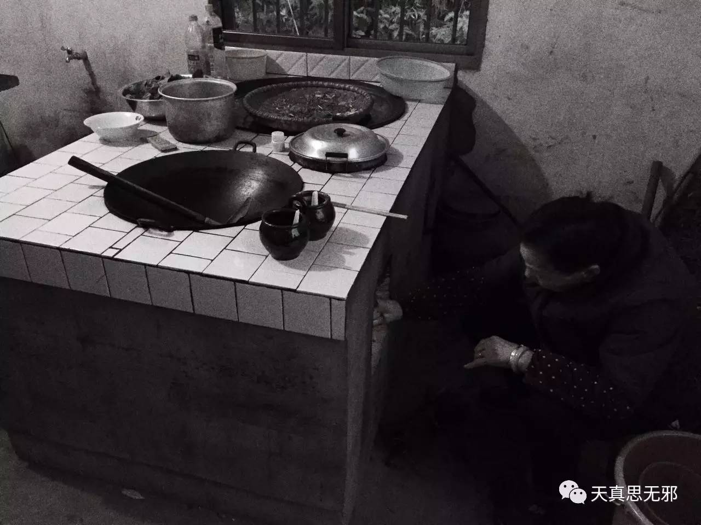

村上春树有句名言：“我一直以为人是慢慢变老的，其实不是，人是一瞬间变老的。”

外婆真的老了，这是今年最难忘的春节记忆。从前过年，家里大小事情全是外婆一个人张罗，收拾屋子、提水洗菜、烧柴做饭，一个人就能做出满满一桌子美味佳肴，忙前忙后也不需要我们帮忙。亲人在身边，外婆就很开心，仿佛永远都这么精神，永远都不会倒下。

但是今年春节回去，发现很多家务活，外婆显得有些力不从心了。腿脚也不利索了，我问外婆，她说腿很痛。前几年的时候，外婆拇指被刀划伤流了很多血，我看着直皱眉，外婆却只是简单包扎了一下就照样忙活去了。原来外婆一个人就能妥妥当当全部搞定的事，现在更多时候需要子女来帮忙，比如炒菜，外婆只充当指导。不是外婆懒了，其实是外婆真的老了。<!-- more -->

不知从什么时候开始，外婆最喜欢的麻将不打了，牌也不打了。晚上大家打牌，外婆就在一旁坐着，以前端茶倒水抓零食招呼大家吃，脸上堆满了笑，现在烤着火眯着眼睛精神恍惚昏昏欲睡。下楼来看到这个场景，等我再下楼的时候外婆已经躺床上睡着了，以前外婆不睡这么早的。一瞬间，我发现外婆真的老了。抢到高铁票的兴奋消失不见，满腹酸楚涌上心头。

童年的暑假，很多是在外婆家度过的。那时外婆家还是那种大块土黄砖砌成的老房子，地是泥巴的带着小坑洼，干燥的大厅是黄色，不见日头的房间久而久之就成深色了，虽然是泥巴地，但硬梆梆的，清扫必须用那种软的高粱杆扫帚，至于脚感我已经忘了，反正夏天时候地面很凉。屋顶着的是瓦片，大根的木头柱子撑起来木头房梁，柱子底下还有个小石头墩儿，小时候没事就喜欢踩在上边试图往上爬。楼梯也是木头造的，踩上去吱呀呀作响，楼上算是阁楼了，没光，铺的是木板，走在上面也会发出很大响动，因为总担心会塌下来，所以一直不敢上去，以至于神秘感越来越强，胡思乱想之下一点小声响动就会吓得不轻，相关的噩梦做了不少。另外门槛也是木头的，大门的门槛比较高，小时候喜欢坐在上面吃饭，觉得特别香。再往早的时候大门上贴有门神，破破烂烂的，凶神恶煞的模样。仅有的模糊记忆中那时候过年气氛很浓，忙碌的灶台，热腾腾的蒸汽，还有厨房中外婆穿梭的身影，喜欢烧柴火的我就拿着吹火筒坐在灶口，递上一把干柴再使劲一吹，火苗腾的一下窜了出来，烤着脸火辣辣红扑扑的。跳动的火焰总是容易让人晃神，比如我就老想着往里边丢上几个红薯，那是吃过一次就永远不会忘却的美味。要是火大了外婆就提醒我小一点，要是吹完不小心吸上一口，被一大口灶灰呛的灰头土脸也是常有的事。那时二外婆还住在大房子的另一边，老外婆还在世，但真的很久远了。

我想外婆之于我的情感，已经深深的印刻在那所老房子里了。如今老房子成为三层小洋楼，外婆也越来越老。初二那天妈妈让表妹帮忙做眉毛，完了问我好不好看，妈妈说“不想你以后带女朋友回来看到一个老妈妈”。每念及至此，便眼眶泛红。

日复一日年复一年，你长大，她们苍老，当爱变作习惯，成为空气一般的存在，便开始习惯性忽略。而我，是不孝的。不仅没能带个女朋友回家，每年也就过年能待上个把礼拜，然后又是匆匆往外赶。当我们渐渐长大，朋友、爱人、孩子……越来越多的人走进我们的生活，我们与父母之间的距离却越来越远，留给他们的时间也越来越少。

带着这样的情感在初四来到深圳，内心相当不踏实，本可以晚几天的。姑外婆劝我好几次我没答应，我想她心里一定很失望。以前有个女孩说我不会表达情感，明明很喜欢但她就是感受不到，认为是我忽略了她。现在意识到我把外婆把父母亲人们也忽略了，而他们就在这种忽略当中老去。

明白这些不知道算不算晚，或许，人也是在一瞬间长大的。

