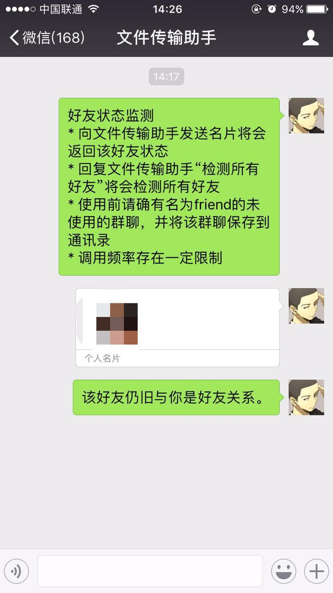

众所周知，微信有公众号、企业号、小程序，它们针对不同人群和场景提供了形形色色的服务。而承载着基础沟通的个人微信号，一直没有赋予任何智慧化的功能。毕竟微信的基石是真实存在的个人，微信不允许机器人存在，至少不要大量存在。就像游戏公司不可能给自己的游戏开发外挂一样。前阵子马化腾对QQ和微信发表了一些个人见解，大意就是现在的微信更像以前的QQ，成为了主要的社交沟通工具；QQ更像是TM，在工作领域用的更多。那么TM的定位就很尴尬了，下线是迟早的事。所以现阶段对微信个人号功能扩展的需求远大于QQ，官方不开放，不代表不可以做，只要加以分析，就可以得到具体的API。

具体从以下两方面入手：

1. Web版微信
2. 安卓版微信

分析过程是很繁琐的，有兴趣的可以参考以下链接：

1. [挖掘微信Web版通信的全过程](http://www.cnblogs.com/dongweiq/p/4941896.html)
2. [利用 Wireshark 软件对微信协议的分析](http://img105.job1001.com/upload/adminnew/2015-03-16/1426491910-WBF50TH.pdf)
3. [微信协议简单调研笔记](http://www.blogjava.net/yongboy/archive/2015/11/05/410636.html)
4. [抓包原理及入门](https://itchat.readthedocs.io/zh/latest/tutorial/tutorial1/)

有了这些接口，我们就可以给个人微信号赋予更强大的功能，比如好友删除检测、控制电脑端程序、智能群发、自动同意好友申请并拉入群聊、消息轰炸、智能聊天机器人、通知机器人、定时发送消息、消息防撤回等等。结合公众号，还能成为一个强大的吸粉工具。
<!-- more -->
目前为止，这部分API在github上有众多语言的封装版本，重复造轮子没有必要，整理几个有代表性的：

1. [HanSon/vbot](https://github.com/HanSon/vbot)（PHP）
2. [Urinx/WeixinBot](https://github.com/Urinx/WeixinBot)（PYTHON）
3. [littlecodersh/ItChat](https://github.com/littlecodersh/ItChat)（PYTHON）

附加一个小例子-----好友删除检测/自动同意所有好友申请并拉入群聊：



```python
#!/usr/bin/env python3
# -*- coding: utf-8 -*-
import itchat
import time

CHATROOM_NAME = 'friend'
CHATROOM = None
HELP_MSG = u'''\
好友状态监测
* 向文件传输助手发送名片将会返回该好友状态
* 回复文件传输助手“检测所有好友”将会检测所有好友
* 自动同意所有好友申请并拉入群聊
* 使用前请确有名为%s的未使用的群聊，并将该群聊保存到通讯录
* 调用频率存在一定限制\
''' % CHATROOM_NAME
CHATROOM_MSG = u'''\
无法自动创建群聊，请手动创建
确保群聊名称为%s
请不要使用已经使用过的群聊
创建后请将群聊保存到通讯录\
''' % CHATROOM_NAME

def get_chatroom():
    global CHATROOM
    if CHATROOM is None:
        itchat.get_chatrooms(update=True)
        chatrooms = itchat.search_chatrooms(CHATROOM_NAME)
        if chatrooms:
            return chatrooms[0]
        else:
            r = itchat.create_chatroom(itchat.get_friends()[1:4], topic=CHATROOM_NAME)
            if r['BaseResponse']['ErrMsg'] == '':
                CHATROOM = {'UserName': r['ChatRoomName']}
                return CHATROOM
    else:
        return CHATROOM

def get_friend_status(friend):
    ownAccount = itchat.get_friends(update=True)[0]
    if friend['UserName'] == ownAccount['UserName']:
        return u'检测到本人账号。'
    elif itchat.search_friends(userName=friend['UserName']) is None:
        return u'该用户不在你的好友列表中。'
    else:
        chatroom = CHATROOM or get_chatroom()
        if chatroom is None: return CHATROOM_MSG
        r = itchat.add_member_into_chatroom(chatroom['UserName'], [friend])
        if r['BaseResponse']['ErrMsg'] == u'请求成功':
            status = r['MemberList'][0]['MemberStatus']
            itchat.delete_member_from_chatroom(chatroom['UserName'], [friend])
            return { 3: u'该好友已经将你加入黑名单。',
                4: u'该好友已经将你删除。', }.get(status,
                u'该好友仍旧与你是好友关系。')
        else:
            return u'无法获取好友状态，预计已经达到接口调用限制。'

def check_all_friends():
    friends = itchat.get_friends()[1:]
    #TODO 每次检测5位后就达到调用限制
    for friend in friends:
        friendStatus = get_friend_status(friend)
        itchat.send(friend['NickName'] + ' -> ' + friendStatus, 'filehelper')
        if friendStatus == u'无法获取好友状态，预计已经达到接口调用限制。':
            break
        # time.sleep(3)
    itchat.send('检测完成', 'filehelper')
    return True

@itchat.msg_register(itchat.content.TEXT)
def auto_reply(msg):
    if msg['ToUserName'] != 'filehelper': return
    if msg['Text'] == '检测所有好友':
        check_all_friends()

@itchat.msg_register(itchat.content.CARD)
def get_friend(msg):
    if msg['ToUserName'] != 'filehelper': return
    friendStatus = get_friend_status(msg['RecommendInfo'])
    itchat.send(friendStatus, 'filehelper')

@itchat.msg_register(itchat.content.FRIENDS)
def auto_add_friend(msg):
    itchat.add_friend(**msg['Text'])
    chatroom = CHATROOM or get_chatroom()
    if chatroom is None: return CHATROOM_MSG
    itchat.add_member_into_chatroom(chatroom['UserName'], [msg['RecommendInfo']])


itchat.auto_login(True)
itchat.send(HELP_MSG, 'filehelper')
itchat.run()
```

以上仅作为抛砖引玉，作为不被官方承认的灰色地带，最好别拿自己微信号做测试，活生生的例子也是有的------[被黑客分分钟玩死的微信聊天机器人](http://www.robot-china.com/news/201606/26/33735.html)。同样也不要使用网上的收费工具，如果不想你的聊天隐私全部暴露的话。

