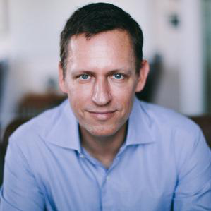

“你如果不清楚历史的来龙去脉，你就不可能知道未来的方向”，读硅谷的历史津津有味让人神往，碍于网上零散信息太多，顺便做个归纳整理。

## 你知道吗？

在硅谷企业强势增长以及美元走强的双重影响下，以美元计，加州的经济体量已达到2.5万亿美元，超过法国成为世界第六大经济体。

加州财政部（California Department of Finance）首席经济学家Irena Asmundson称，2015年加州GDP增长4.1%，超过美国全国2.4%的增速，以及法国1.1%的增速。
而硅谷，就是整个加州的经济引擎。
<!-- more -->

## 硅谷的“谷”到底在哪里?

它是从圣塔克拉拉谷（Santa Clara Valley）中得到的。所谓的硅谷，并非是一个地理名词。它位于美国加州北部旧金山湾以南。再详细一点，是沿着旧金山湾南端101公路，从门罗公园（Menlo Park）、帕罗奥托（Palo Alto）经山景城(Mountain View)、桑尼维尔(Sunny vale)到硅谷的中心圣塔克拉拉谷(Santa clara valley)，再到圣何赛(San Jose)的这条长约50英里的狭长地带。下图的上方红框是旧金山众多现代初创公司的聚集地，而下方就是硅谷。

## 在你爱上硅谷前，你首先会爱上它的气候

地球上只有2%的土地拥有地中海式气候，它们都在沿海地区，例如西班牙、希腊、摩洛哥……硅谷一定是得到了上帝的眷顾，成了其中一员。这里全年阳光明媚得实在难以让人抗拒。以帕罗奥托（Palo Alto）为例，通常夏季凉爽，平均气温20摄氏度多一点；而冬季，平均气温10摄氏度左右。

硅谷为什么难以被世界复制的原因有很多，但是无以伦比的气候，恰恰是最容易被忽略的最重要原因之一。

## 原来盛产“苹果”的硅谷，历来就盛产水果

如果把硅谷历史的指针拨回到上个世纪，你就可以想象，在一个世纪之前，阳光孕育下的“硅谷”还是一片农田、果树和葡萄藤。20世纪初，圣塔克拉拉谷（Santa Clara Valley）又名“欢乐谷”，除了盛产西红柿、樱桃和胡桃之外，还出产了全世界1/3的梅干。

## 加州阳光除了培育果园还培育了什么？

美国西部淘金热成就了旧金山。随着圣塔克拉拉谷的铁路逐渐完善，这里已经成为当时全球最大的罐装食品和水果加工中心。而家底殷实的富裕人家慢慢聚居到了这里。他们基本上都是因为淘金热和铁路系统建设而搬迁到了美国西海岸的。

橘色的加州阳光除了培育水果甘甜，还赋予了这片土地自由创新的精神。

1909年，西里尔-艾维尔(CyrilEwell)就和他的团队研发出了首台美国造的电弧发射机。

同年，查尔斯-哈罗德（CharlesHerrold）在这里创造了全球首个无线广播电台。

到了1912年，无线电之父李-德-弗雷斯特(Lee de Forest)与联邦电报公司合作，发明了世界上首个无线电系统。

## Hello，硅谷之父

随着越来越多的大学兴建，但是并无法满足学生们毕业后的职业发展。斯坦福大学教授弗兰德里克·特曼（Frederick Terman）对于学生们毕业后总是到东海岸去寻找机会而十分不满，于是在学校里用闲置的空地进行不动产的发展，并设立了大量的项目鼓励学生创新，发展他们的“风险投资”。而教授们开始和企业进行无数富有创见的实验及开发。同时，从那个时候开始，以创新为导向，允许失败的观念不断鼓舞着斯坦福的莘莘学子们，直到现在，大家都会认可斯坦福就是硅谷的心脏和大脑，而弗兰德里克·特曼便是大家口中的“硅谷之父”。

## “硅谷”由此而来

在斯坦福大学第一批女毕业生中，有一位便是成就了“本世纪最伟大发明”的“晶体管之父”——威廉·肖克利的母亲。肖克利是独子，父亲是采矿工程师，麻省理工（MIT）毕业生，精通八国语言。在1936年，肖克利加入贝尔实验室的时候，那里已经是人才济济，贝尔实验室对高科技的贡献令人咋舌。你所知的射电天文学、晶体管、激光、太阳能、移动通讯、UNIX操作系统、C和C++语言等理论和技术均出自贝尔实验室。

1947年12月16日， 改变历史的晶体管在肖克利领头的实验室里诞生了。晶体管Transistor由传（Transfer）和电阻（resister）合成，几年之后，人们发现硅比锗更适合于生产晶体管。于是，硅就替代了锗，这，便是“硅谷”的由来了。

## “8个叛徒”影响硅谷未来

1955年，肖克利（W.Shockley）博士离开贝尔实验室返回故乡圣克拉拉，创建“肖克利半导体实验室”。这一喜讯，正中特曼教授为硅谷网罗天下英才之下怀： 有了肖克利这棵“梧桐树” ，何愁引不到成群的“凤凰”来？电子电脑界焦急地关注着肖克利的行踪。 据说，300年前当牛顿宣布准备在他的故乡建一所工厂时，全世界的物理学界也是如此心态。不久，因仰慕“晶体管之父”的大名，求职信像雪片般飞到肖克利办公桌上。第二年，八位年轻的科学家从美国东部陆续到达硅谷，加盟肖克利实验室。他们是：罗伯特·诺伊斯（N. Noyce）、戈登·摩尔（Gordon Moore）、布兰克（J.Blank）、克莱尔（E.Kliner）、赫尔尼（J.Hoerni）、拉斯特（J.Last）、罗伯茨（S.Roberts）和格里尼克（V.Grinich）。他们的年龄都在30岁以下，风华正茂，学有所成，处在创造能力的巅峰。他们之中，有获得过双博士学位者，有来自大公司的工程师，有著名大学的研究员和教授，这是当年美国西部从未有过的英才百家乐大集合。

29岁的诺依斯是八人之中的长者，是“投奔”肖克利最坚定的一位。当他飞抵旧金山后所做的第一件事，就是倾囊为自己购下一所住所，决定永久性定居，根本就没有考虑到工作环境、条件和待遇。其他七位青年，来硅谷的经历与诺依斯大抵相似。可惜，肖克利是天才的科学家，却缺乏经营能力；他雄心勃勃，但对管理一窍不通。特曼曾评论说：“肖克利在才华横溢的年轻人眼里是非常有吸引力的人物，但他们又很难跟他共事。”一年之中，实验室没有研制出任何象样的产品

八位青年瞒着肖克利开始计划出走。在诺依斯带领下，他们向肖克利递交了辞职书。肖克利怒不可遏地骂他们是“八叛逆”（The Traitorous Eight）。青年人面面相觑，但还是义无反顾离开了他们的“伯乐”。不过，后来就连肖克利本人也改口把他们称为“八个天才的叛逆”。在硅谷许多著作中，“八叛逆”的照片与惠普的车库照片，具有同样的历史价值。

## 仙童半导体公司

“八叛逆”找到了一家地处美国纽约的摄影器材公司来支持他们创业，这家公司名称为Fairchild，音译“费尔柴尔德”，但通常意译为“仙童”。仙童摄影器材公司的前身是谢尔曼·费尔柴尔德（S. Fairchild）1920年创办的航空摄影公司。费尔柴尔德不仅是企业家，也是发明家。他的发明主要在航空领域，包括密封舱飞机、折叠机翼等等。由于产品非常畅销，他在1936年将公司一分为二，其中，生产照相机和电子设备的就是仙童摄影器材公司。

当“八叛逆”向他寻求合作的时候，已经60多岁的费尔柴尔德先生仅仅提供了3600美元的种子基金， 要求他们开发和生产商业半导体器件， 并享有两年的购买特权。于是，“八叛逆”创办的企业被正式命名为仙童半导体公司，“仙童”之首自然是诺依斯。

1957年10月，仙童半导体公司仍然在硅谷瞭望山查尔斯顿路租下一间小屋，距离肖克利实验室和距离当初惠普公司的汽车库差不多远。“仙童”们商议要制造一种双扩散基型晶体管，以便用硅来取代传统的锗材料，这是他们在肖克利实验室尚未完成却又不受肖克利重视的项目。费尔柴尔德摄影器材公司答应提供财力，总额为150万美元。诺依斯给伙伴们分了工，由赫尔尼和摩尔负责研究新的扩散工艺，而他自己则与拉斯特一起专攻平面照相技术。

1958年1月， IBM公司给了他们第一张订单，订购100个硅晶体管，用于该公司电脑的存储器。
到1958年底，“八叛逆”的小小公司已经拥有50万销售额和100名员工，依靠技术创新优势，一举成为硅谷成长最快的公司。

仙童半导体公司在诺依斯精心运筹下，业务迅速地发展，同时，一整套制造晶体管的平面处理技术也日趋成熟。天才科学家赫尔尼是众“仙童”中的佼佼者，他像变魔术一般把硅表面的氧化层挤压到最大限度。仙童公司制造晶体管的方法也与众不同，他们首先把具有半导体性质的杂质扩散到高纯度硅片上，然后在掩模上绘好晶体管结构，用照相制版的方法缩小，将结构显影在硅片表面氧化层，再用光刻法去掉不需要的部分。

扩散、掩模、照相、光刻……，整个过程叫做平面处理技术，它标志着硅晶体管批量生产的一大飞跃，也仿佛为“仙童”们打开了一扇奇妙的大门，使他们看到了一个无底的深渊：用这种方法既然能做一个晶体管，为什么不能做它几十个、几百个，乃至成千上万呢？1959年1月23日，诺依斯在日记里详细地记录了这一闪光的设想。

1959年2月，德克萨斯仪器公司（TI）工程师基尔比（J.kilby）申请第一个集成电路发明专利的消息传来，诺依斯十分震惊。他当即召集“八叛逆”商议对策。基尔比在TI公司面临的难题，比如在硅片上进行两次扩散和导线互相连接等等，正是仙童半导体公司的拿手好戏。诺依斯提出：可以用蒸发沉积金属的方法代替热焊接导线，这是解决元件相互连接的最好途径。仙童半导体公司开始奋起疾追。 1959年7月30日，他们也向美国专利局申请了专利。为争夺集成电路的发明权，两家公司开始旷日持久的争执。1966年，基尔比和诺依斯同时被富兰克林学会授予巴兰丁奖章，基尔比被誉为“第一块集成电路的发明家”而诺依斯被誉为“提出了适合于工业生产的集成电路理论”的人。1969年，法院最后的判决下达，也从法律上实际承认了集成电路是一项同时的发明。

1960年，仙童半导体公司取得进一步的发展和成功。由于发明集成电路使它的名声大振， 母公司费尔柴尔德摄影器材公司决定以300万美元购买其股权，“八叛逆”每人拥有了价值25万美元的股票。1964年，仙童半导体公司创始人之一摩尔博士，以三页纸的短小篇幅，发表了一个奇特的定律。摩尔天才地预言说道，集成电路上能被集成的晶体管数目，将会以每18个月翻一番的速度稳定增长，并在今后数十年内保持着这种势头。摩尔所作的这个预言，因后来集成电路的发展而得以证明，并在较长时期保持了它的有效性，被人誉为“摩尔定律”，成为新兴电子电脑产业的“第一定律”。

## 没有仙童，就没有后来硅谷的孩子们，包括乔布斯

60年代的仙童半导体公司进入了它的黄金时期。 到1967年，公司营业额已接近2亿美元，在当时可以说是天文数字。据那一年进入该公司的虞有澄博士（现英特尔公司华裔副总裁）回忆说：“进入仙童公司，就等于跨进了硅谷半导体工业的大门。”然而，也就是在这一时期，仙童公司也开始孕育着危机。母公司总经理不断把利润转移到东海岸，去支持费尔柴尔德摄影器材公司的盈利水平。目睹母公司的不公平，“八叛逆”中的赫尔尼、罗伯茨和克莱尔首先负气出走，成立了阿内尔科公司。据说，赫尔尼后来创办的新公司达12家之多。随后，“八叛逆”另一成员格拉斯也带着几个人脱离仙童创办西格奈蒂克斯半导体公司。从此，纷纷涌进仙童的大批人才精英，又纷纷出走自行创业。

正如苹果公司乔布斯形象比喻的那样：“仙童半导体公司就象个成熟了的蒲公英，你一吹它，这种创业精神的种子就随风四处飘扬了。”脱离仙童半导体创办公司者之中，较有名气的是查尔斯·斯波克（C.Sporck）和杰里·桑德斯（J. Sanders）。斯波克曾一度担任过仙童半导体公司总经理，1967年出走后，来到国民半导体公司（NSC） 担任CEO。他大刀阔斧地推行改革，把NSC从康涅狄格州迁到了硅谷， 使它从一家亏损企业快速成长为全球第6大半导体厂商。桑德斯则是仙童半导体公司销售部主任，1969年，他带着7位仙童员工创办高级微型仪器公司（AMD），这家公司已经是仅次于英特尔公司的微处理器生产厂商，K6、K6-2等微处理器产品畅销全世界。

1968年，“八叛逆”中的最后两位诺依斯和摩尔，也带着格鲁夫（A. Grove）脱离仙童公司自立门户， 他们创办的公司就是大名鼎鼎的英特尔（Intel）。虽然告别了仙童，“八叛逆”仍然约定时间在一起聚会，最近的一次是1997年，8人之中只有6人还健在。似乎要高扬“八叛逆”的“叛逃”精神，一批又一批“仙童”夺路而出，掀起了巨大的创业热潮。对此，80年代初出版的著名畅销书《硅谷热》（Silicon Valley Fever）写到：“硅谷大约70家半导体公司的半数，是仙童公司的直接或间接后裔。在仙童公司供职是进入遍布于硅谷各地的半导体业的途径。1969年在森尼维尔举行的一次半导体工程师大会上， 400位与会者中，未曾在仙童公司工作过的还不到24人。”从这个意义上讲，说仙童半导体公司是“硅谷人才摇篮”毫不为过。

## 至此，硅谷成为全球创新中心

如图，由仙童的“八叛逆”创立的公司有：

1. Amelco

2. Intel（摩尔和诺伊斯）

3. Intersil

4. Kleiner Perkins Caufield & Byers （KPCB里的K，也就是Eugene Kleiner，是八叛逆一员）

5. Signetics

6. 由其他仙童工程师/管理人员创立的公司：AMD

7. Atmel

8. CadenceChips & Technologies

9. Cirrus Logic

10. Computer Microtechnology

11. Cypress

12. Four Phase

13. Linear Technology

14. National Semiconductor

15. LSIPMC-Sierra

16. Rheem Semiconductor

17. Seed Technology

18. Sequoia Capital （大名鼎鼎的红杉资本，由仙童销售VP Don Valentine创立）

19. SynapticsSynertek

20. VLSI Technology

21. Wafer Scale Integration

22. Xilinx

23. Zilog

这些公司的员工、创始人又创业，于是就有了我们今天看到的繁荣的硅谷。

随后，谷歌、苹果电脑、微软、雅虎、Ebay……才相继诞生，另外，世界上三家最大的Web2.0公司中的两家，YouTube和Facebook也在这里（另外一个是Twitter）。从此， 硅谷成为了全球创新的代名词，创新性互联网公司在这里遍地开花。

## PayPal的诞生

其实二十一世纪也出了一个像仙童一样树大根深的公司，那就是paypal。

1998年末，麦克斯·列夫琴(Max Levchin)、彼得·泰尔（Peter Thiel）以及卢克·诺塞克（Luke Nosek）共同创建了支付公司Confinity。泰尔与列夫琴是在斯坦福大学认识的，当时泰尔刚刚发表了嘉宾演讲，两人随后开始合作开发电子钱包的概念。Confinity最初专注于移动支付业务，即在掌上电脑和PDA设备上支持移动支付，但Confinity的一位员工最终开发出了通过电子邮件转账的方法。1999年，这项服务变成了PayPal。

随着服务越来越受欢迎，并在eBay平台上进行了初步整合后，Confinity与伊隆·马斯克（Elon Musk）创建的X.com合并，并采用了母公司的名字。但在2001年夏，在PayPal作为产品取得成功后，该公司采用了PayPal作为公司名字。

泰尔表示：“在我们创建PayPal的时候，我还记得与列夫琴早年进行过的一次谈话。当时我想创办一家每个人都能成为好朋友的公司，即无论公司发生了什么事情，但友谊能够长存不衰。从某种意义上来说，这种想法有点儿乌托邦的性质。我们不仅招募自己的朋友，还招那些我们认为可以成为真正好朋友的人。”

其中，许多友谊始于斯坦福大学。基思·拉波伊斯(Keith Rabois)、大卫·萨克斯（David O. Sacks）、里德·霍夫曼（Reid Hoffman）以及肯·霍华利( Ken Howery)等人，几乎都是同时进入斯坦福大学就读的，且先后被泰尔招入PayPal为其效力。列夫琴也从伊利诺伊大学香槟分校那里招募了许多开发人员和以前的同学。

“PayPal黑帮”成员以及大多数早期PayPal员工的独特之处在于，他们都是通过朋友圈招募来的，而非通过猎头公司。萨克斯说，这些人都是“一个模子里刻出来的”，这就可以解释这些人为何从一开始就对创业如此的专注。

## PayPal的成长与危机

PayPal的服务在2000年2月推出到同年4月，使用人数从10万成长到100万，平均每天增加5~7%的使用者，两年时间使用人数就超过1,300万人，PayPal光收取成交手续费营收就超过1亿美金，虽然表面看起来非常成功，但这样的成长速度却是用「钱」堆出来的，因为当时为了抢占市场，只要用户注册会员即可得到10块美金，推荐朋友可再得到10块美金，再加上网路诈骗的问题，所以财务很快就出现了问题。

随着网络泡沫来临，他们没有足够的时间及精力思考未来的事，处理压力的方式就是「疯狂的专注力」，每天专注如何让这艘船不要沉。钻石跟石墨是相同元素组成，唯一差别就是「压力」，这群人也因为这样想到许多方法让PayPal存活下去。这段时间他们一起熬夜，共同面对压力，有些人要负责抵抗eBay、有些人要负责打开eBay以外的市场，也因为PayPal成长得很快速，这群人更是相依为命，一起吃饭、一起加班、一起休息、一起打游戏，彼此成为彼此这段时间的社交圈，这就是为什么大家离开后还能延续出现在我们看到的PayPal Mafia的原因之一。

很幸运的虽然2000年网络泡沫破裂，但eBay、Amazon、Zappos等电子商务平台却受使用者的热爱，而且网络使用人数也持续攀升，让当时的PayPal能够在网络泡沫前募集到足够的资金营运下去，甚至在911恐怖攻击后大环境一片悲观之际宣布打算IPO，最后在2002年7月以15亿美金高价卖给eBay，虽然不是每个人都满意被eBay并购的决定，但在种种考察之后泰尔仍然决定将PayPal出售。

## PayPal黑帮成型

PayPal出售后，因为组织架构及企业文化的改变，当初的元老们都拿着分配的红利纷纷离开eBay，有些人成为投资人开始投资新创公司，有些人开始另一个创业旅程，他们身上都拥有冒险进取的勇气及解决问题的能力，所以并不会因为一次成功而甘于现状，而是准备好投入更多的挑战。PayPal也因此一举成为硅谷史上创造创业者群体最多的一家公司，这些人被誉为“PayPal黑帮”。

“PayPal黑帮”绝非真正的黑手党，只是散落在世界各地的“移民社群”。PayPal前首席运营官、Yammer现任首席执行官大卫·萨克斯（David Sacks）曾这样形容它：“基本上，我们是被赶出故土的一群人，他们焚毁了我们的神庙。我们散落在世界各地，不得不重新建立新家。”

在硅谷，“PayPal黑帮”已经成为被人喜爱和敬畏的术语，用来形容IPO前或被收购前的山景城PayPal团队。
PayPal前首席执行官彼得·泰尔（Peter Thiel）估计，“PayPal黑帮”成员大约有220人，不包括当时在美国内布拉斯加州奥马哈进行客服运营的700人。这220人创建了7家独特的“独角兽”企业。所谓“独角兽”就是估值超过10亿美元的初创企业，其中2家企业估值已经超过100亿美元。这些公司包括：

1. 特斯拉电动汽车公司：市值275亿美元
2. 职业社交网站LinkedIn：市值204亿美元
3. 情报分析公司Palantir：估值90亿美元
4. 美国太空技术探索公司SpaceX ：估值70亿美元
5. 美国最大点评网站Yelp：市值52.6亿美元
6. 视频分享网站YouTube：被谷歌以16.5亿美元收购
7. 企业社交网络服务提供商Yammer：被12亿美元收购

为了方便对比，我们可以看看谷歌的员工构成。谷歌员工数量大约在2万到3万人，而由谷歌员工创建的“独角兽”企业数量却很难找到。泰尔估计，谷歌只有1到3家“独角兽”企业，而且估值都不到100亿美元。如果谷歌的“独角兽”企业为2家，那么就意味PayPal以谷歌1/100的人力取得了3.5倍的效果。换句话说，这意味着PayPal创建超过10亿美元企业的成功率是谷歌的350倍。

## 传奇的黑帮成员

1. **Facebook种子天使，PayPal老大——皮特·泰尔（Peter Thiel）**

皮特·泰尔是Paypal创始人，著名PayPal黑帮的“don”（头目）。他在1998年和Max Levchin共同创立Confinity，也就是后来被我们所熟知的Paypal，从此开启了一段传奇的书写。在2002年，eBay以15亿美金收购Paypal，泰尔将持有PayPal的3.2%股份全部套现5500万美金。

离开Paypal之后，泰尔以天使投资人的身份投资不少项目，最牛逼的案例当属2004年的一个案例，50万美金，收到了回报是2000倍，这个案例就是著名的社交网络——Facebook。与扎克伯格半小时的见面，敲定投资50万美金占了Facebook10.2%的股份，2012年Facebook上市，泰尔光套现就超过10亿美金，目前他仍保留500万股及董事局席位。

在eBay收购PayPal之后，开启的PayPal帮的创业热潮，这群创业者就是PayPal 黑帮的核心。作为PayPal黑帮的老大，泰尔扮演了火箭助推器的角色，在2005年成立了VC基金Founders Fund。该基金投资的几个知名案例包括Slide、LinkedIn、Yammer、Yelp，而这些成功的项目的创始人均来自Paypal黑帮。

历史总是惊人的相似，有钱的高富帅往往都是 Gay，而泰尔是一个特别记仇的Gay，他花了十年时间把黑他的媒体公司Gawker搞到破产，欲知故事详情敬请移步<http://www.jiemian.com/article/701659.html>

另外他还有一本讲创业的书《从0到1》，也是火的一塌糊涂，引用另一部风险大作《黑天鹅》的作者Taleb评论就是：“当一个有冒险精神的人写书了，你务必读一遍；如果这个作者是皮特·泰尔，就要读两遍；可是，为了保险起见，请你读三遍”。

2. **全球最大职业社交网站LinkedIn——雷德·霍夫曼（Reid Hoffman）**

雷德·霍夫曼是Paypal创建之初董事会董事之一，曾任职苹果，在90年代就在苹果负责试探性的尝试社交网络，2000年全职加入Paypal，担任COO职位，随后担任PayPal的执行副总裁，被泰尔称之为Paypal的救火队员，哪里有问题就让霍夫曼去。

2002年霍夫曼创立了著名职业社交网站LinkedIn，他也无愧为硅谷的人脉王，LinkedIn本身就是一个人脉神器。LinkedIn在2011年上市，他个人的股票估值超过23.4亿美金，目前市值超过250亿美金。

人脉王的霍夫曼正是Facebook创始人扎克伯格和Thiel第一次见面的引荐人，之后他与泰尔一起投资了Facebook。同时，Hoffman以天使投资人身份投了不少天使项目，我们所熟知的案例有社交游戏公司Zynga、图片分享网站Flickr。

3. **真人版钢铁侠——埃隆·马斯克（Elon Musk）**

马斯克被称之为真人版的“钢铁侠”，1999年将自己创立网络银行X.com与泰尔创立Confinity合并，从此更名为PayPal。2002年，eBay收购PayPal，马斯克是PayPal最大的自然人，拥有11.7%的股份，是Theil的3倍多。

离开PayPal后，马斯克拥有多重身份，精力无限。是Hyperloop超级高铁、SpaceX太空探索技术公司、环保电动汽车公司特斯拉（Tesla）以及SolarCity家用光伏发电四家公司的CEO。

北京时间2016年4月9日凌晨4时52分，马斯克旗下公司美国SpaceX公司终于成功在大西洋上回收猎鹰9号一级火箭，这也是人类历史上首次在海上实现火箭回收。2016年9月22日，彭博全球50大最具影响力人物排行榜，埃隆·马斯克排第11名。2016年12月14日，荣获“2016年最具影响力CEO”荣誉。

《硅谷钢铁侠》讲的就是他，号称目前地球上最牛逼的人。

4. **社交游戏公司Slide——麦克斯·拉夫琴（Max Levchin）**

拉夫琴是PayPal联合创始人之一，在PayPal担任CTO一职，PayPal的首席计算机科学家，eBay的收购给他带来了大约3400万美金的财富。2004年，拉夫琴创办社交游戏公司Slide，在2010年，Google以1.82亿美元的价格收购Slide，拉夫琴从中又斩获3600万美金，并加盟google。

比较有意思的是，拉夫琴同时美国最大点评类网站Yelp的最大股东，持有7000万股，并担任董事局主席。2012年年底，受邀加入Yahoo董事局。2006年加入云笔记Evernote 董事局，并且他也是云笔记Evernote的投资人，目前Evernote估值10亿美金。

目前他继续创业中，出任金融初创企业Affirm CEO及联合创始人，该项目去年融资4500万美元，投资者包括风投公司Khosla和光速投资。

5. **美国最大点评类网站Yelp——杰里米·斯多普尔曼（Jeremy Stoppelman）&拉塞尔·西蒙斯（Russel Simmons）**

斯多普尔曼之前是在钢铁侠Musk的网络银行X.com工作，随着X.com与泰尔创立Confinity合并，斯多普尔曼也被带入PayPal，从而结识了拉塞尔·西蒙斯和麦克斯·拉夫琴。

当斯多普尔曼和西蒙斯把自己的创业想法告诉了拉夫琴，拉夫琴毫不犹豫成为了他们的种子投资人，当时出资100万美金，而斯多普尔曼和西蒙斯的这个创业想法，诞生了之后美国最大点评类网站——Yelp。Yelp曾经收到Google收购邀约，Apple的乔帮主曾致力斯多普尔曼放弃Google收购邀约，成就了2012年3月Yelp成功IPO，目前市值超过50亿美金。

斯多普尔曼个人还投资不少项目，包括Eventbrite、Palantir Technologies、Pinterest和Airbnb、Uber。其中打车鼻祖Uber估值超过170亿美金，回到已经数千倍，旅游短租Airbnb估值也已达100亿美金。

6. **全球最大的视频网站YouTube——查德·赫利（Chad Hurley）、陈士骏（Steve Chen）&贾德·卡林姆（Jawed Karim）**

在PayPal，陈士骏遇见了查德·赫利、贾德·卡林姆，并在2005年3人共同创立了著名视频网站YouTube，仅在一年后就以16亿美金的价格卖给了Google。

收购之后查德·赫利、陈士骏继续往视频社交方向开始创业——MixBit，而贾德·卡林姆做开始往投资人角色发展，成立了YoUniversity 基金，看名字就知道是扶植大学生创业的基金。

7. **企业内部社交网络Yammer——大卫·萨克斯（David Sacks）**

1999年，萨克斯从咨询巨头麦肯锡跳槽加盟PayPal，被eBay收购时，萨克斯担任PayPal COO。离开PayPal后，萨克斯去追赶自己电影梦，以独立制作人身份参与筹拍了金球奖影片《感谢你吸烟》。2006年创办了网络族谱服务Geni.com，2012年被MyHeritage收购。2008年，萨克斯创立企业社会化网络服务工具Yammer。

如今，Yammer拥有超过500万已认证的企业用户，其中包括《财富》杂志500强公司中85%以上的员工。2012年，Microsoft在12年以12亿美金的价格收购Yammer，此外，值得一提的是，萨克斯也是Uber的天使投资人。

8. **互联网信息安全产品提供商IronPort——斯科特·巴尼斯特（Scott Banister）**

巴尼斯特是Paypal创建之初董事会董事之一，一直列席PayPal董事会。2000年底， 巴尼斯特和Scott Weiss联合创立了IronPort，在 2007以8.3亿美金的价格卖给了思科。同时，巴尼斯特投资过的项目将近100家公司，其中包括Zappos、Uber、Facebook等。

9. **董事之王——罗洛夫·博沙（Roelof Botha）**

2011年出任PayPal的CEO，后加盟硅谷顶级风险投资公司红杉资本，出任该公司的合伙人。列席多家科技类公司董事，包括Jawbone, Eventbrite, Evernote, Mahalo, Natera, Nimbula, Square, Tokbox, Tumblr, Weebly, Unity, Whisper and Xoom，在Google收购之前，曾任Youtube、Meebo董事。

10. **黄金简历——基思·拉布伊斯（Keith Rabois）**

拉布伊斯曾在PayPal前同事创办的许多家公司任职， 包括LinkedIn、Slide、 Square、 Khosla Ventures，个人投资了不少好项目包括Tokbox、Xoom、Slide、 LinkedIn、Geni、	Room 9 Entertainment、YouTube、LinkedIn、YouTube和Slide。

去年，拉布伊斯加盟移动支付公司Square并出任首席运营官。如今，Square的估值已超过10亿美元。

11. **硅谷孵化器500 Startups——戴夫·迈克克勒（Dave McClure）**

迈克克勒在 PayPal 任营销主管。2010年，在硅谷创立一家企业孵化和投资公司——500 Startups。如今，500 Startups已孵化300多个项目，更为偏好女性创业者。其孵化及投资项目包括Twilio、Wildfire、MakerBot、SendGrid、Credit Karma等，其中社交媒体营销公司Wildfire Interactive已被谷歌以3.5亿美元收购；3D打印公司MakerBot被同领域巨头Stratasys以4亿美元并购；云通信服务公司Twilio第四轮融资后估值达5亿美元。