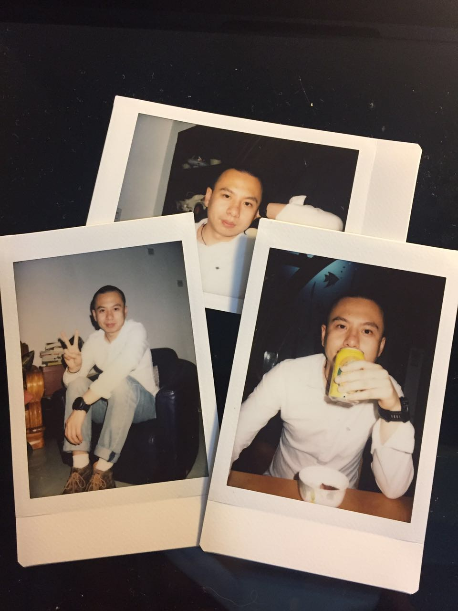

是的，哥30了。还是叔30了？不知道该怎么说。没有一丝防备就得知这个“悲痛”的消息，不是对自己岁数没概念，而是感叹这天来得也忒快了些，有点方。要知道我本打算洗洗睡的，再说忘记生日也不是一次两次了，偏偏就在刚刚父母一个电话过来祝我生日快乐，这才惊觉过来------30了哦，亲~

是的，我不过生日，尽管30是个大生。热闹不是我作风，安安静静度过这一天才能让我感到踏实。佛教讲究“诸行无常”，就是说世间万物无时无刻不在变化，终归是要灭亡的。告诫世人要认清这个客观事实，超脱在其之外，不必烦扰其中。若能大彻大悟，那自然是好。虽然我不信佛，但生日在我眼中也不过是年纪又长了一岁，更大的意义反倒是母亲在当年生产时候的痛苦。也许之后会跟爱人一起来个温馨的晚餐。但在此之前，我还是决定跟以前一样，该吃吃该睡睡，亲人朋友的祝福，一一收在心里就好。<!-- more -->

之前就计划着写点什么，现在反倒显得仓促了。刚失去奔三的资格，多少有些无所适从，总觉得哪里不对。不过该写的还是得写，若是不记录点什么，就有白忙活了的感觉。我妈说：“从此以后你就是过一年老一岁了”，我知道这个老指的是什么，但终归得妥协不是，万物的自然规律，对每个人都是公平的。所以嘴上说着“是啊”，一边又想了很多。

去年的时候就想着做一番事业以让我这30岁来的更有意义，工作这么多年，掌握那么多经验和技能，不发光发热简直就是埋没自己。一年下来，谈不上顺利，好在过程是历练人的，不至于没有收获。路再难走，还是得前进。可以不用那么赶，但一定要注意脚下，慢一点也许就达到了。大不了就选另外一条路咯。

一直都是成熟尚且不足，幼稚稍显有余，直到去年开始才稍有改观，怎么说呢，还是得去经历，要对人事敏感。当然我也觉得一个人的成熟就是能坦然面对自己的不成熟，以前认真的那些事，现在倒也淡然了。以一个好的心态去面对未来，是我当下迫切需要去做的。2500年前，孔子就告诫前来求学的人：“吾十有五而志于学，三十而立”。这句话至今仍足以振聋发聩，警醒世人。30岁之前是助跑，30岁之后才是真正的启航。只有那些在30岁之前做好准备的人，才有可能在30岁之后的岁月里披荆斩棘，有所建树。若以这个为标准，我显然没有达标------事业没有成功，感情还没有归宿。当然失败也谈不上，处在一个比上不足比下有余的尴尬境地。如果说一直都在准备着，努力让自己变得更优秀，以期将来的某一天能把握住机会，我自己都会觉得惭愧。真的一但到了这个年纪，就失去了所有的可以为自己掩饰的借口了。

20几岁懵懵懂懂，希望30以后不再那么迷糊：
1. 爱自己，特别是身体
2. 懂得放柔软，懂得爱别人
3. 管理好情绪，戒骄戒躁
4. 经营好人际关系，他山之石可以攻玉
5. 明确的生活态度，不要优柔寡断
6. 不要害怕改变而不去改变，适度脱离舒适区
7. 保持好奇心，天真思无邪
8. 慢一点也没关系
9. 就算重来也没有关系

最后，祝自己生日快乐！祝亲人朋友天天开心！

