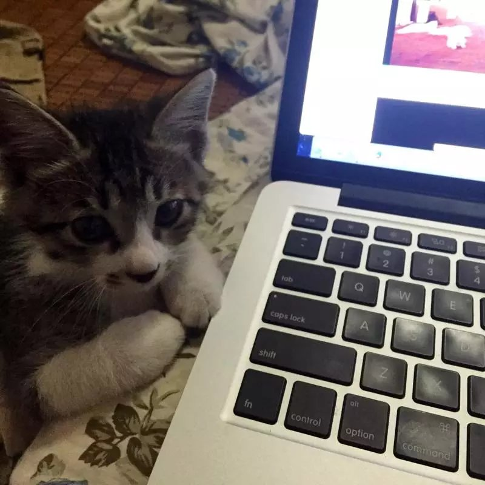

一直以为自己是不喜欢猫的，总认为它们没狗忠诚，直到遇上了年年。

也许是头脑发热，或许是因为寂寞，鬼使神差稀里糊涂就把他带回了家，当时心里想的是一份责任，不抛弃不放弃，要一直养下去。一窝小奶猫里一眼看中这个小家伙，想必这就是缘分。

为了取名也是煞费苦心，最后通过知乎取了一个跟别人家一样的名字----年年，因为年年有鱼。特别满意这个名字，也希望年年跟着我能过的好好。
<!-- more -->
然而事实证明，我并不是一个好主人。我别的不会，只知道给他吃，这样大半年过去，年年就被我养成了一只“猪”，医院一称12斤多。于是年年又多了两个外号，“年年猪”，“胖年年”。年年没有抱怨，还是一如既往的粘着我。

一直觉得对不起年年，小时候没少被我揍。因为小控制不好自己的爪子，我的手脚裤子总是被划烂。长大后就好了很多，只是我心中多了一层愧疚。但我更爱这个小家伙了，他也更爱我。每次回家还没到家门口他就开始喵喵叫，一坐下就跳到我腿上求摸摸，早上出门还会在窗口目送，走哪都屁颠屁颠的跟着。我没想到你是这样的年年，你们喵星人不应该都是高高在上不当回事的主子么。当别人开始羡慕我，说你就像一只狗的时候，我脸色平静，但内心是非常高兴的呀。

还有一件事我对不起年年，那就是我把他阉了，直接让他变成了公公。说实话这让我耿耿于怀，要知道在此之前我就想好了，等他发情了我就放他出去找小姑娘。虽然不同类，但同为雄性动物，小心思什么的我都懂。然而医生说猫这类物种繁殖能力超强，几年时间就能繁衍出几万只。所以对不起，痛定思痛就剥夺了你的生育权。

因为总觉得之前的房子太小才让年年这么胖的，所以过了年就搬家了。我倒无所谓，更希望年年能多蹦跶蹦跶减减肥。只是好景不长，没几天就踩到了粘鼠板，又是被我送医院剃毛又是被我拿面粉跟油一顿搓。最后医院也没辙，年年这家伙太凶了，除了我对任何人都特别防备。只好亲自上阵来剪毛，我握着年年的手感觉他一直在抖，但还是放心的交给我，这种信任，是很微妙的。

又过了些天，达西来了，特别乖，过年被抛弃在外，好心的室友捡了回来。我们又是洗澡又是体检，最后发现是对面餐馆的猫，只好作罢送了回去。但谁曾想仅这么数日，年年就被感染上了猫瘟。刚开始是到处乱撒尿，被我小教训了一顿，再过2天就是急性的呕吐了，那样子是谁看了都会心疼。医生说幼猫得了这个病基本上宣告死亡，但成猫他们医院能有九成的治愈率，我相信他，心里也是一直抱着希望等待年年康复归来，零食都买了好多。

噩耗来自于今天早上，医生在微信里说年年不行了，正在抢救，视频我看了一个没敢继续往下看，心唰的一下就凉了，因为我知道年年不行了。我是一个感性的人，只是在外经常会表现出很理性的一面，然而眼泪还是几欲掉落下来。这里要感谢刘棠，是她专程跑过去料理了年年的后事，说这也是年年跟她的缘分。养了猫就认识了一些爱猫的人，你们真的都特别好。

只是以后再也不会有一只小肥猫屁颠屁颠的跟在我后面了，也不会喵喵喵的拿头蹭我了，再也听不到年年的咕噜声。这种难受很多年未曾有过，不养宠物的人很难理解。

年年有鱼，希望来世你再找个好人家。

