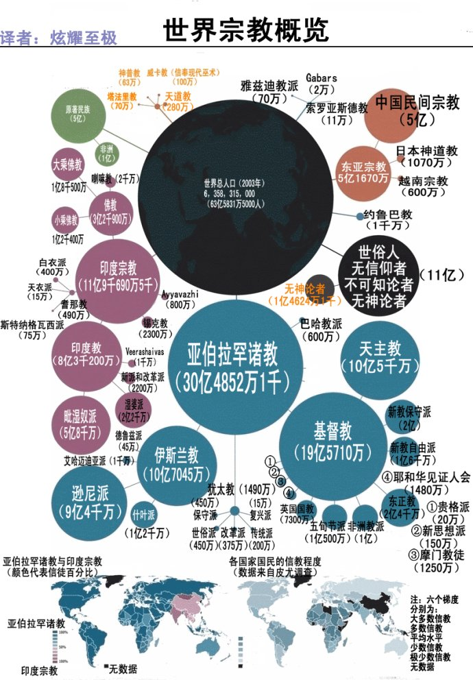
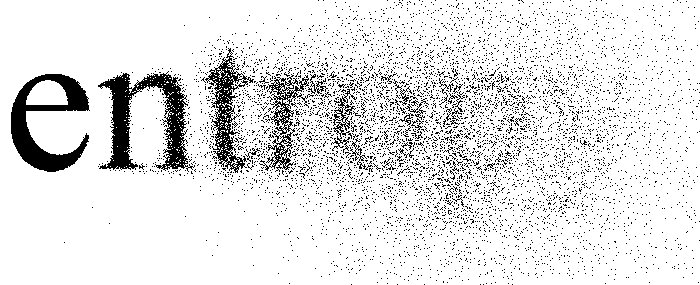

> 世界上最早的宗教“挪亚—亚伯拉罕信仰”起源于公元前15世纪。
>
> 熵的概念是由德国物理学家克劳修斯于1854年提出的。

宗教和熵，于我都是”新鲜“的东西。我对宗教的理解主要来源于——《一本读懂世界三大宗教》这本入门书籍，和之后从网上阅读的大量文章。由于没有系统性的研读，缺乏深入，属于囫囵吞枣式的初浅理解。然后熵的概念是几天前从阮一峰博客了解到的。所以这不是一篇科普文章。

作为伴随人类文明成长的“庞然大物”，宗教、科学莫不博大精深，仅一小瞥就足以刷新我的世界观，引发了很多思考，本文对我个人的一知半解作个整理归纳。<!-- more -->

## 宗教的世界观

如果你不去了解，你可能不会知道全世界有80%多的人信仰宗教，到现在为止，还没有哪个国家没有宗教。其中又以基督宗教信徒最多，其次伊斯兰教，再次印度教，佛教之所以能列入三大宗教，主要是因为信徒的分布比较广，影响比较深远。而我们这些无信仰人士，就属于那“可怜”的少数派了，大概只有15%左右。

三大宗教自古以来便是超越了民族和人种壁障的超然存在，在历史舞台上为人类的思维带来莫大的影响。尽管在中国大多数人对宗教漠不关心，但是许多自古以来的规范与习俗，都与佛教息息相关。还有风行的圣诞节，其根本就是基督宗教的重要庆典。因此即便有人说“不信仰任何宗教”，却也难逃宗教带来的影响。若想要更进一步认识这个世界，宗教就成了一个很好的入口。于是你大概知道了为何中东总是恐怖主义盛行、战乱不堪，为何美钞上印着“In God We Trust”，基督为何死而复活，伊斯兰教为何禁止偶像崇拜等。。。

中国文化认为：有一个创始人、有崇拜对象为“宗”；有一群追随者，有一定的祭祀仪式为“教”，但因为中国受佛教影响，宗教最早是佛教的专门术语，直到后面才被引申扩大；西方文化的宗教religion是从拉丁词“re”和“legere”演变来的，意思是“再次”和“聚集”，就是一群人为了一个目的反复聚集在一起的意思，进而发展到有同一信仰，同一信念，甚至为了这一信仰而到了不畏生死的地步。

我一直把宗教的起源归于人类文明低阶时期的科技落后、思想愚昧以及社会的不公，这种环境下，当中的极少数思维进化者出于某种对现状的不满，进而开始从精神上寻求慰藉，开始思考我们从哪里来，这个世界有什么弊病，我们要如何更正它，当达到一定程度后便开始影响他人，通过传教到最终形成一种社会意识形态，是超脱于国家政治约束的存在。基督宗教圣经上说我们是神的造物，被设计为管理这个世界并与神建立关系；我们人类的祖先亚当和夏娃被魔王撒旦化身的毒蛇诱惑偷食禁果对神犯的”原罪“，导致整个人类世界受到神的咒诅，神牺(化)牲(身)了(为)他的儿子耶稣基督拯救世界。这在我这种无神论者看来是很愚昧的，因为宗教只要求人相信，不要求人问为什么。但是历经了几千年社会发展变迁，在教育、科学、生产力都有相当高的现代社会中，宗教不但没有灭亡，反而随着社会的发展越来越广泛，而且还有很多新的宗教在产生，其根本的原因我觉得还是信仰激起的积极向上的力量和作为一种精神寄托的存在，这种力量给人以团结、正面的姿态推动着时代之轮向前迈进。

是人便分善恶，利益的驱使和教义认同的冲突是造成宗教分裂的最主要因素。再加上历史上政教之间的种种瓜葛，宗教一度成为利益集团最强大的精神工具，比如宗教常常被统治阶层用来作为统治人民的精神工具。另一方面，宗教也常常被反抗者用来作为反抗压迫的工具。很多宗教派系的政治分歧甚至大过教义分歧。所以这纷乱不堪的世界，归根到底都是人的欲望造成的。

释迦摩尼通过苦修，得出”三法印“的世界观，”诸行无常“、”诸行无我“、”涅槃寂静“，从客观认识这个世界到超脱七情六欲达到开悟的境界。我觉得非常了不起，同时三法印跟熵的世界观又有非常相似之处，以至于我现在就觉得佛教就是最科学化的宗教。中文的“世界”一词就是来自佛教。“世”指迁流，“界”指方位，前者有过去、现在、未来，后者有东西南北、四维上下。所以佛教所说的世界是一个时空结合的概念。佛陀告诉人们，这个宇宙是无量无边、不可思议的浩瀚。一千个太阳、一千个月亮组成的世界为一个「小千世界」，而以一千个「小千世界」形成一个「中千世界」，再以一千个「中千世界」为一个「大千世界」。因为其中重叠三个千数，所以称「三千大千世界」。而「三千大千世界」并非一个，而是无量无数并存于宇宙空间。所以佛陀常说：「十方虚空无有穷尽，世界国土不可限量。」。2600多年前就能得出这样的结论，想想都是不可思议。

## 熵，一种新的世界观

> 19世纪，物理学家开始认识到，世界的动力是能量，并且提出"能量守恒定律"，即能量的总和是不变的。但是，有一个现象让他们很困惑。物理学家发现，能量无法百分百地转换。比如，蒸汽机使用的是热能，将其转换为推动机器的机械能。这个过程中，总是有一些热能损耗掉，无法完全转变为机械能。一开始，物理学家以为是技术水平不高导致的，但后来发现，技术再进步，也无法将能量损耗降到零。他们就将那些在能量转换过程中浪费掉的、无法再利用的能量称为熵。后来，这个概念被总结成了"热力学第二定律"：能量转换总是会产生熵，如果是封闭系统，所有能量最终都会变成熵。

以上摘自阮一峰博客，阮老师最厉害的本领就是能够将复杂抽象的概念解释的通俗易懂。

熵是热力学中表征物质状态的参量之一，其物理意义是体系混乱（无序）程度的度量。也就是说一个越有序的系统熵值越小，越无序的熵值越大，但前提是这个系统是封闭的。冰块吸收热量转变为水就是水分子从高度有序转变为无序的过程，水吸收能量再蒸发为水蒸气，无序程度再度增加，如果不施加外力影响，熵值永远是朝着增大的方向自发的进行。宇宙万物皆是如此，只是表现形式不尽相同。当未来某一天宇宙万物的“熵”达到最大时，所有可用的能量消耗殆尽，所有物质温度达到热平衡，再也没有任何维持运动或是生命的能量存在，只剩下永恒的死寂，这种状态被称为热寂。时间在这个时候将不复存在。目前普遍认为的宇宙大爆炸说，某种程度指的就是宇宙熵的增加，这种增加的力量是大于万有引力的，当达到某个临界点（热寂），宇宙会发生大坍缩，也就是大爆炸的逆过程。但 是这一切都是建立在宇宙是一个封闭的系统前提之下。目前有人认为宇宙其实是一个巨大的黑洞，若是如此，宇宙便不是一个封闭的系统，它会源源不断的吸收宇宙之外的能量。甚至马斯克还说我们宇宙有可能是某高等文明虚拟出来的一个世界，这个就更难以接受了。

现今人们往往有一个错觉，认为煤和石油是“生产”或”加工“出来的，其实更确切的说法应该是“找到”和“开采”，这些宝贵的化石资源是地球所赋予的、不可替代和再生的有限资本，是我们人类生存的能量的基石。由于经济的快速增长和人们对科学技术的崇拜和放纵，世界非再生的能源和物质的耗散速度在不断递增，而这些能源和资源的滥用正把世界的总熵值提高到一个非常危险的水平。许多人相信，只要我们发展适当的技术，那么我们所用过的一切东西都是可以被完全回收并被再次利用的。其实不然，虽然更为有效的回收技术对我们这个星球的生存的确有着十分重要的意义，然而这个回收过程其实就是外力作用于熵的过程，从无序到有序，是需要施加外部力量的，这些外部力量又从何而来呢？如果宇宙是一个封闭系统，那么所有可利用的能量就必然是一个常量，总有一天会枯竭。所以任何”可再生资源“都应该打上一个引号。因为这个过程一样在产生熵，当有一天熵(能)值(量)增(无)大(序)到我们科技水平无法将其转变为有序的时候，人类的灭亡就是可预期的了。所以我们无法逆转时间或熵的过程，但我们可以用我们的行动来决定熵增过程的发展速度，那就是低碳，然后低熵。

百度百科把熵世界观定义为极端的环境悲观主义的哲学意识，我认为是不妥的。哪怕世界最终必然走向消亡，也并不是我们忧心忡忡不思进取的借口。熵的过程既非乐观也非悲观，物理学定律告诉我们的仅仅是客观世界的运转规律。它的适用范围有多大，以后会不会被推翻，都为未可知。正是因为几千年来的努力，人类学会了使用越来越多的外部能量，有了这些能量的注入，文明才朝着更有序的方向发展。但这样是有代价的，物理学告诉我们，没有办法消除熵和混乱，我们只是让某些局部变得更有秩序，把混乱转移到另一些领域。套用佛教的理解就是”诸法无我“，宇宙间并不存在任何一成不变的物体，那么也就不可能存在独立于万物之外的自我，如果认清了这个本质，就可以放下执着，任何烦恼都不复存在。这种思想对于当今社会的浮躁是很有益处的。