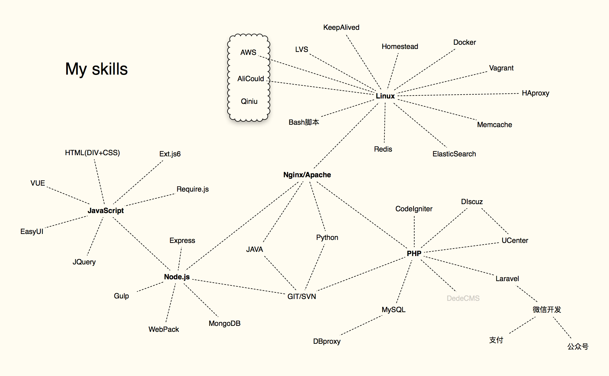

# About me

Do all you can to be a better man

```php
$me = new GoodMan();
$me->name = 'Kay';
$me->gender = 'male';
$me->age = 30;
$me->position = 'Programmer';
$me->character = 'optimism';
$me->hobbies = ['coding', 'reading', 'cycling', 'fitness'];
$me->skills = ['PHP','JAVA','Node.js','Python','CodeIgniter','Laravel','dedeCMS','UCenter','Discuz','DIV+CSS','JavaScript','VUE','EasyUI','Require.js','ExtJS6','HTML5+CSS3','Nginx','HAproxy','KeepAlived','LVS','MySQL','MongoDB','DBproxy','Redis','ElasticSearch','Memcache','Git','SVN','Vagrant','Homestead','Docker','AWS','AliCloud','Qiniu','微信支付','微信公众号'];
$me->single = true;

while ($you = $me->find('My Heart')) {
    if (!is_null($you)) {
        $me->out = 'Hello World!';
    }
}
```

